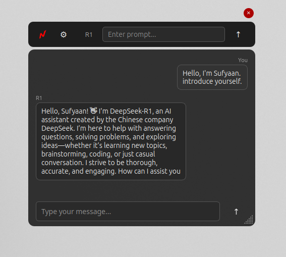
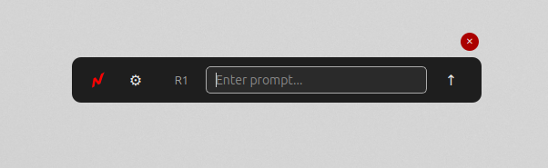

# Nexlify: Your Intelligent AI Companion 🚀

[](/)

**Nexlify** transforms how you interact with AI by bringing the world's most powerful language models to your fingertips through an elegant, unified interface. More than just an AI platform, Nexlify is your personal AI companion that adapts to your needs, learns from your interactions, and delivers exceptional results—all while being completely **free**.

Imagine having a team of specialized AI experts at your command: Google's cutting-edge Gemini models for creative thinking, Groq's lightning-fast inference for time-sensitive tasks, and OpenRouter's diverse ecosystem for specialized capabilities—all accessible through a single, beautifully designed application that lives right in your system tray.

Whether you're a developer seeking AI-powered code assistance, a writer looking for creative inspiration, a researcher needing up-to-date information, or simply curious about what modern AI can do, Nexlify provides a seamless experience that grows more valuable with every interaction. With features like conversation history, bookmarking, code enhancement, and web search capabilities, Nexlify isn't just an AI tool—it's an extension of your digital workspace that evolves alongside you.

> "Nexlify bridges the gap between powerful AI technology and everyday usability, making state-of-the-art language models accessible to everyone."

## Table of Contents

1.  [Features ✨](#features-)
2.  [Models Powering Nexlify 🧠](#models-powering-nexlify-)
3.  [Advanced Features 🔍](#advanced-features-)
    - [Online Search Capability](#online-search-capability)
    - [Uptime Optimization](#uptime-optimization)
    - [Conversation History](#conversation-history)
    - [Code Block Enhancement](#code-block-enhancement)
    - [Bookmarks System](#bookmarks-system)
    - [Prompt Templates](#prompt-templates)
4.  [Usage 🛠️](#usage-️)
    - [Distribution](#distribution)
    - [Google API Integration](#google-api-integration)
    - [Groq Implementation](#groq-implementation)
    - [OpenRouter Configuration](#openrouter-configuration)
    - [Command Reference](#command-reference)
5.  [Credits 🙏](#credits-)
6.  [Third-party Services 🤝](#third-party-services-)

## Features ✨

<div align="center">
  <table>
    <tr>
      <td align="center">🔄</td>
      <td><b>Unified Interface</b><br/>Access multiple AI models through a single, elegant interface</td>
      <td align="center">🌐</td>
      <td><b>Online Search</b><br/>Get up-to-date information from the web</td>
    </tr>
    <tr>
      <td align="center">💾</td>
      <td><b>Conversation History</b><br/>Automatically save and revisit past interactions</td>
      <td align="center">⚡</td>
      <td><b>Uptime Optimization</b><br/>Ensure maximum availability with intelligent routing</td>
    </tr>
    <tr>
      <td align="center">📝</td>
      <td><b>Prompt Templates</b><br/>Create and reuse your favorite prompts</td>
      <td align="center">🔖</td>
      <td><b>Bookmarks System</b><br/>Save important AI responses for quick access</td>
    </tr>
    <tr>
      <td align="center">💻</td>
      <td><b>Code Enhancement</b><br/>Beautiful syntax highlighting and easy copying</td>
      <td align="center">🔌</td>
      <td><b>System Tray Integration</b><br/>Quick access without desktop clutter</td>
    </tr>
    <tr>
      <td align="center">🔄</td>
      <td><b>Multi-Provider Support</b><br/>Google, Groq, and OpenRouter integration</td>
      <td align="center">🆓</td>
      <td><b>Free to Use</b><br/>Powerful AI capabilities at no cost</td>
    </tr>
  </table>
</div>

Nexlify combines these powerful features into a seamless experience that adapts to your workflow. Whether you're coding, writing, researching, or exploring AI capabilities, Nexlify provides the tools you need to be more productive and creative.

[](/)
_Example of Nexlify in action_

## Models Powering Nexlify 🧠

<div align="center">
  <h3>🌟 Google AI Models</h3>
</div>

|                                                                            Model                                                                            | Description                                                                                               | Best For                                                                    |
| :---------------------------------------------------------------------------------------------------------------------------------------------------------: | :-------------------------------------------------------------------------------------------------------- | :-------------------------------------------------------------------------- |
|  | An experimental version designed for rapid thinking and response generation with cutting-edge performance | Creative brainstorming, experimental workflows, quick insights              |
|     | A lightweight version optimized for speed and resource efficiency                                         | Mobile applications, real-time responses, resource-constrained environments |

<div align="center">
  <h3>⚡ Groq Models</h3>
</div>

|                                                                       Model                                                                       | Description                                                                                | Best For                                                                            |
| :-----------------------------------------------------------------------------------------------------------------------------------------------: | :----------------------------------------------------------------------------------------- | :---------------------------------------------------------------------------------- |
|  | Powerful combination of Deepseek R1 architecture and Qwen 32B model with exceptional speed | High-throughput applications, real-time content generation, complex reasoning tasks |

<div align="center">
  <h3>🔄 OpenRouter Models</h3>
</div>

|                                                                     Model                                                                     | Description                                                                      | Best For                                                                   |
| :-------------------------------------------------------------------------------------------------------------------------------------------: | :------------------------------------------------------------------------------- | :------------------------------------------------------------------------- |
|                    | Based on the Mistral architecture, known for balanced performance and efficiency | General-purpose tasks, creative content, conversational AI                 |
|                 | A massive 70B parameter model from Meta's Llama 3 family                         | Complex reasoning, in-depth analysis, sophisticated language tasks         |
|  | A very large-scale Reasoning model with significant capabilities                 | Research tasks, cutting-edge experiments, maximum model capacity needs     |
|                  | The latest iteration in the Deepseek series with advanced architecture           | State-of-the-art applications, latest model technology                     |
|                           | A 32B parameter model from the Qwen series with strong performance               | Wide range of general AI tasks, content generation, versatile applications |

<div align="center">
  <p><i>All OpenRouter models support online search and uptime optimization features</i></p>
</div>

_Nexlify is committed to continuously expanding its model offerings. Stay tuned for more integrations!_

## Advanced Features 🔍

<div class="feature-cards">
  <div align="center">
    <h3>🌐 Online Search Capability</h3>
    <p>Get real-time information from the web through your AI interactions</p>
    <details>
      <summary><b>Learn More</b></summary>
      <ul>
        <li><b>Enabled by Default:</b> Online search is enabled by default for all OpenRouter models.</li>
        <li><b>Toggle with Command:</b> Use the <code>/online</code> command to toggle this feature on/off.</li>
        <li><b>Implementation:</b> When enabled, ":online" is appended to the model name in OpenRouter API requests.</li>
        <li><b>Use Cases:</b> Current events, recent developments, fact-checking, and research queries.</li>
      </ul>
    </details>
  </div>

  <div align="center">
    <h3>⚡ Uptime Optimization</h3>
    <p>Ensure maximum availability with intelligent routing between providers</p>
    <details>
      <summary><b>Learn More</b></summary>
      <ul>
        <li><b>How It Works:</b> OpenRouter continuously monitors the health and availability of AI providers, tracking response times, error rates, and availability across all providers in real-time.</li>
        <li><b>Automatic Fallback:</b> When enabled, if the primary provider is down or experiencing issues, requests are automatically routed to alternative providers.</li>
        <li><b>Enabled by Default:</b> Uptime optimization is enabled by default for all OpenRouter models.</li>
        <li><b>Toggle with Command:</b> Use the <code>/uptime</code> command to toggle this feature on/off.</li>
        <li><b>Implementation:</b> When enabled, the "route": "fallback" parameter is added to OpenRouter API requests.</li>
      </ul>
    </details>
  </div>

  <div align="center">
    <h3>💾 Conversation History</h3>
    <p>Never lose an important conversation again</p>
    <details>
      <summary><b>Learn More</b></summary>
      <ul>
        <li><b>Automatic Saving:</b> Every conversation is automatically saved with timestamps and model information.</li>
        <li><b>History Browser:</b> Access your conversation history through the history button in the interface.</li>
        <li><b>Load Past Conversations:</b> Easily load any previous conversation to review or continue where you left off.</li>
        <li><b>Delete History:</b> Remove unwanted conversation records to maintain privacy and organization.</li>
        <li><b>Metadata Tracking:</b> Each saved conversation includes details like the model used, timestamp, and message count.</li>
        <li><b>File-Based Storage:</b> Conversations are stored as JSON files in the "history" folder, making them easy to back up or transfer.</li>
      </ul>
    </details>
  </div>

  <div align="center">
    <h3>💻 Code Block Enhancement</h3>
    <p>Beautiful syntax highlighting and convenient functionality for developers</p>
    <details>
      <summary><b>Learn More</b></summary>
      <ul>
        <li><b>Syntax Highlighting:</b> Automatic language detection and syntax highlighting for over 20 programming languages.</li>
        <li><b>Copy Button:</b> One-click copying of code blocks to your clipboard.</li>
        <li><b>Language Identification:</b> Automatic identification of programming languages based on code content.</li>
        <li><b>Visual Distinction:</b> Code blocks are visually distinct from regular text, making them easy to identify.</li>
        <li><b>Scrollable Blocks:</b> Long code snippets are contained in scrollable blocks to maintain a clean interface.</li>
        <li><b>Monospace Formatting:</b> Code is displayed in monospace font for proper alignment and readability.</li>
      </ul>
    </details>
  </div>

  <div align="center">
    <h3>🔖 Bookmarks System</h3>
    <p>Build your personal knowledge base of valuable AI responses</p>
    <details>
      <summary><b>Learn More</b></summary>
      <ul>
        <li><b>Quick Bookmarking:</b> Use the <code>/mark</code> command to bookmark the last AI response.</li>
        <li><b>Bookmark Browser:</b> View all your bookmarks with the <code>/bookmark</code> command.</li>
        <li><b>Persistent Storage:</b> Bookmarks are saved between sessions for long-term reference.</li>
        <li><b>Delete Functionality:</b> Remove unwanted bookmarks to keep your collection organized.</li>
        <li><b>Model Tracking:</b> Each bookmark records which model generated the response.</li>
        <li><b>Direct Insertion:</b> Insert bookmarked content directly into the chat with a single click.</li>
      </ul>
    </details>
  </div>

  <div align="center">
    <h3>📝 Prompt Templates</h3>
    <p>Create and manage reusable prompts for consistent results</p>
    <details>
      <summary><b>Learn More</b></summary>
      <ul>
        <li><b>Save Templates:</b> Use the <code>/save [name]</code> command to save the current prompt as a template.</li>
        <li><b>Browse Templates:</b> Access your saved templates with the <code>/prompts</code> command.</li>
        <li><b>Quick Insertion:</b> Insert any template into the input field with a single click.</li>
        <li><b>Delete Option:</b> Remove templates you no longer need.</li>
        <li><b>Persistent Storage:</b> Templates are saved between sessions for long-term use.</li>
        <li><b>Organization:</b> Keep your frequently used prompts organized and readily available.</li>
      </ul>
    </details>
  </div>
</div>

<style>
.feature-cards {
  display: grid;
  grid-template-columns: repeat(auto-fit, minmax(300px, 1fr));
  gap: 20px;
  margin: 30px 0;
}

.feature-cards > div {
  background: #f8f9fa;
  border-radius: 8px;
  padding: 20px;
  box-shadow: 0 4px 6px rgba(0, 0, 0, 0.1);
  transition: transform 0.3s ease, box-shadow 0.3s ease;
}

.feature-cards > div:hover {
  transform: translateY(-5px);
  box-shadow: 0 10px 20px rgba(0, 0, 0, 0.1);
}

details {
  margin-top: 15px;
  cursor: pointer;
}

summary {
  padding: 8px 0;
  color: #0366d6;
}

details[open] summary {
  margin-bottom: 10px;
}
</style>

## Usage 🛠️

### Distribution

**Nexlify AppImage (Linux - Beta)**

For Linux users seeking a convenient, portable, and self-contained application, Nexlify is also available as an **AppImage** in beta testing.

- **Download:** You can find the Nexlify AppImage in the **"Releases"** section of our GitHub repository. Look for files named like `Nexlify-x86_64.AppImage` or similar.
- **Make Executable:** After downloading, you'll likely need to make the AppImage executable. You can do this in your terminal using:
  ```bash
  chmod +x Nexlify-x86_64.AppImage
  ```
  (Replace `Nexlify-x86_64.AppImage` with the actual filename you downloaded.)
- **Run:** Simply double-click the AppImage file to run Nexlify, or execute it from the terminal:
  ```bash
  ./Nexlify-x86_64.AppImage
  ```

**Important Note for AppImage Users:**

When using the Nexlify AppImage, it's crucial to understand how API keys are loaded. The AppImage is a single, packaged file. To ensure Nexlify can access your API keys, you **must place the `.env` file in the same directory where you have stored the Nexlify AppImage file.**

For example, if you download `Nexlify-x86_64.AppImage` and place it in your `Downloads` folder, your `.env` file (containing `GOOGLE_API_KEY`, `GROQ_API_KEY`, `OPENROUTER_API_KEY`, etc.) must also be located in the `Downloads` folder alongside the AppImage. **Failing to place the `.env` file in the correct location will prevent Nexlify from accessing your API keys, and it will not function correctly.**

### Google API Integration

1.  **Obtain Google API credentials** from the [Google Cloud Console](https://console.cloud.google.com/). You'll need to create a project and enable the Generative Language API.
2.  **Add your API key to the `.env` file:**

    ```env
    GOOGLE_API_KEY=your_google_api_key_here
    ```

### Groq Implementation

1.  **Sign up for Groq access** at [groq.com](https://groq.com).
2.  **Add your Groq API key to the `.env` file:**

    ```env
    GROQ_API_KEY=your_groq_api_key_here
    ```

### OpenRouter Configuration

1.  **Create an account at [OpenRouter](https://openrouter.ai/)**.
2.  **Generate an API key** from your OpenRouter account.
3.  **Add your OpenRouter API key to the `.env` file:**

    ```env
    OPENROUTER_API_KEY=your_openrouter_api_key_here
    ```

**Running Nexlify (from Source or Extracted ZIP):**

1.  **Ensure you have Python installed** (version 3.7 or higher is recommended).
2.  **Create a virtual environment** (optional but recommended):
    ```bash
    python -m venv .venv
    source .venv/bin/activate  # On Linux/macOS
    .venv\Scripts\activate     # On Windows
    ```
3.  **Install dependencies:**
    ```bash
    pip install -r requirements.txt
    ```
4.  **Run Nexlify:**
    ```bash
    python Nexlify.py
    ```
    Nexlify will start in your system tray. Click the system tray icon to open the application.

### Command Reference

Nexlify supports several slash commands that can be used in the chat interface:

| Command        | Description                        |
| :------------- | :--------------------------------- |
| `/help`        | Show available commands            |
| `/prompts`     | List or use saved prompt templates |
| `/save [name]` | Save current prompt as template    |
| `/bookmark`    | View saved bookmarks               |
| `/mark`        | Bookmark last AI response          |
| `/online`      | Toggle online search capability    |
| `/uptime`      | Toggle uptime optimization         |

To use a command, simply type it in the chat input field and press Enter.

[](/)

## Credits 🙏

Nexlify was developed with passion and dedication by **dev-sufyaan**. All credit and gratitude are due to **Allah SWT**.

## Third-party Services 🤝

Nexlify leverages the following exceptional third-party services to deliver its powerful AI capabilities:

- **Google Cloud**: Provides access to cutting-edge API services, including the Gemini family of models.
- **Groq**: Offers high-performance inference infrastructure, enabling incredibly fast AI responses.
- **OpenRouter**: Acts as a versatile LLM routing service, providing access to a diverse range of models from various providers.

---

Thank you for exploring Nexlify! We hope you find it a valuable tool in your AI journey. If you have any questions, feedback, or contributions, please feel free to reach out. Happy AI innovating!
